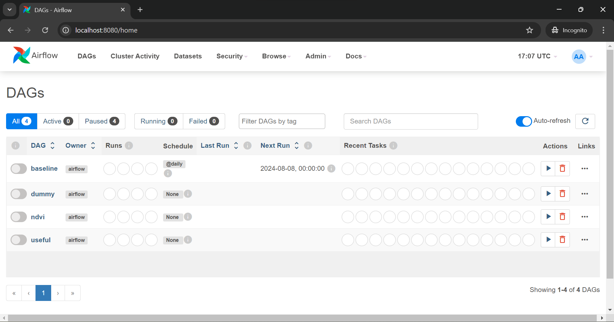
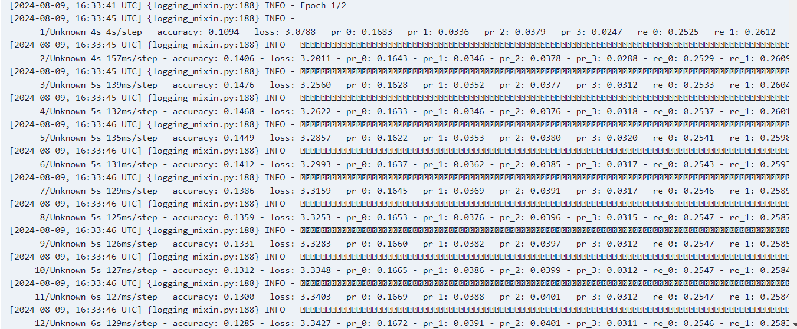
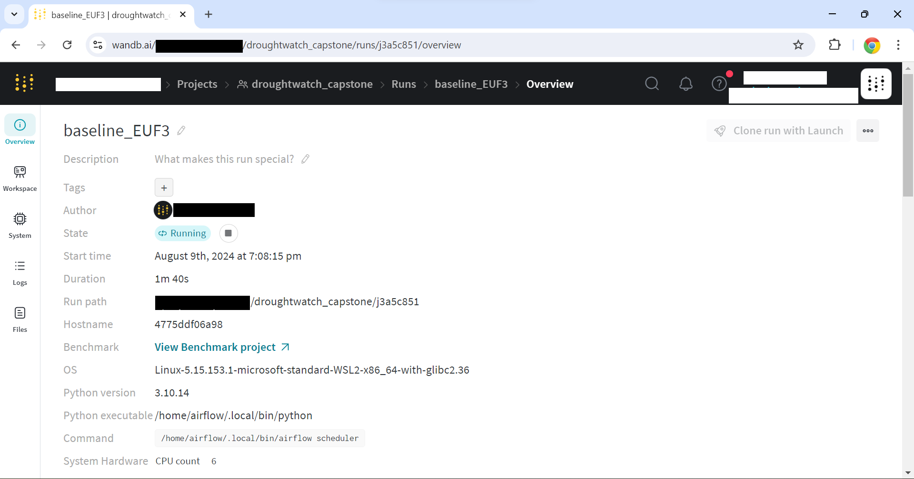
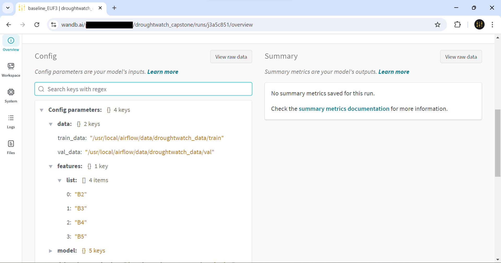
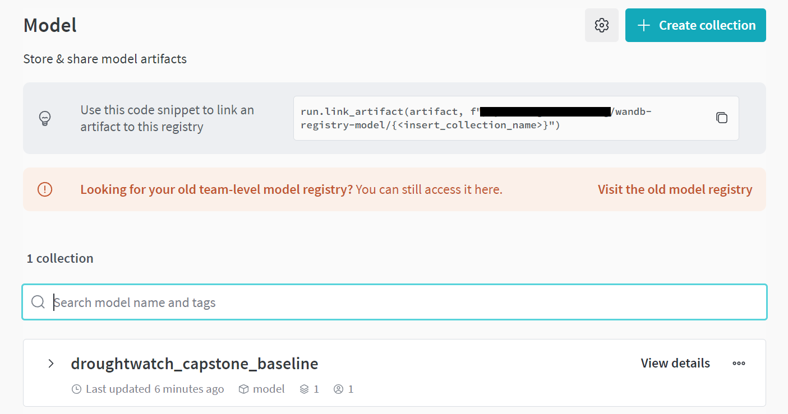

# The training pipeline
## Overview
The training process is orchestrated using [Apache Airflow](https://airflow.apache.org/docs/apache-airflow/stable/index.html). Airflow is a mature, robust and well-documented open-source workflow engine, that is [extremely widely used](https://www.astronomer.io/state-of-airflow/).

The diagram below shows the overall architecture of the training pipeline. The entire training environment is inside a Docker container for reproducibility and ease of deployment.

=== "W&B-based"

    

=== "MLFlow-based"

    

The tasks to be performed are organised in DAGs (Directed Acyclic Graphs), where each node corresponds to a given task. Airflow keeps track of the dependencies between tasks, as well as the logging of each task execution and the scheduling of the DAGs. Given that our model uses a large amount of data, we elected not to to handle the downloading of the raw data as a task in a DAG. Instead we use [a script](https://github.com/SergeiOssokine/droughtwatch_capstone/blob/main/utils/download_data.py) that downloads the data to local storage.

The raw data is in the form of about a hundred of TensorFlow [TFRecord files](https://www.tensorflow.org/tutorials/load_data/tfrecord), which is an efficient binary storage format for Tensor data sets. The raw data is not quite suitable for training and thus we transform it by:
- normalising the data in every band to be in the range [0,1]
- filtering completely blank observations (defined as having no intensity in any pixel in any band)

We also add several derived features which can be useful in training, namely:

- Normalised Difference Vegetative Index (NDVI)
- Normalised Difference Moisture Index (NDMI)
- Enhanced Vegetative Index (EVI)

These indices are constructed specifically to assess the presence of vegetation and moisture from satellite imagery. For more information, see [here](https://www.usgs.gov/landsat-missions/landsat-surface-reflectance-derived-spectral-indices). The updated data is then written back to disk as TFRecord files, so that it can be used for training. The processing task will construct a simple json ledger file (`training/airflow/data/droughtwatch_data/*/data_hashes.json`) that contains every processed file and its md5sum. The next time it is run, the processing task will first check whether any given file is present in the ledger, and whether the md5sum matches. If everything matches, the data is not reprocessed. This allows for quick retraining of the DL model.

The model is constructed in Keras and then trained on the processed data. During this process, the user has a choice of which experimentation tracking system to use. By default, the code uses [Weights and Biases Cloud platform](https://wandb.ai/). This allows for easy, convenient, and comprehensive tracking. The other choice is MLFlow, which runs in the same container as the Airflow server. After the model is trained, depending on the settings, it is promoted to the model registry, either in WandB or MLFlow. Regardless of the service used, the model is also uploaded to S3 so it can be used later for inference. To ensure maximum efficiency and portability, the model is converted from the native Keras format to the [ONNX standard](https://onnx.ai/), which produces highly efficient models for inference.

**Thus the basic DAG has two steps: i) Data processing ii) Model training.**

## The model
The model we choose to be the base for this project is a simple CNN architecture, since modelling is not the focus of this project. This model takes in images in any of the provided bands/derived features and attempts to predict the labels, which correspond to the number of goats that can be supported. The summary of the baseline model can be seen below:

The training data contains a class imbalance: 60% of all labels are of class 0 (poor forage quality). To compensate, we use direct class weights defined as follows:

- class 0: 1
- class 1: 4
- class 2: 4
- class 3: 6

We use a standard cross-entropy categorical loss. The user can easily adjust the following parameters through the config files:

- learning rate
- batch size
- list of features to use

For simplicity, only the baseline model is set to be committed to the model registry. In practice, one would run a whole series of experiments and then select and tag the best model based on the results, with this model being promoted to the registry. In this way experimentation is a constant process, whereby re-training can result in finding a better model, which can be tagged and promoted to take the previous model's place in the infrastructure, or flexibly rolled back if necessary. We also provide DAGs to train some other models, which vary the features that the model is trained on, as well as the amount of epochs the model is trained, which serves as an elementary hyperparameter search.

## Airflow pipeline in detail
### Code structure
All the DAGs are currently defined in [one file](https://github.com/SergeiOssokine/droughtwatch_capstone/blob/main/training/airflow/dags/pipeline.py). This choice was made in order to [easily reuse](https://github.com/SergeiOssokine/droughtwatch_capstone/blob/main/training/airflow/dags/pipeline.py#L17) the first part of any DAG, which is to preprocess the data. There are only two tasks in each DAG, each defined as a `PythonOperator`, which is just a Python function. We separate the the actual code that does the tasks from the task definitions, with the preprocessing done [here](https://github.com/SergeiOssokine/droughtwatch_capstone/blob/main/training/airflow/includes/parse_data.py) and the training [here](https://github.com/SergeiOssokine/droughtwatch_capstone/blob/main/training/airflow/includes/train.py). There is extensive logging to enable easier debugging, as well as [unit tests](https://github.com/SergeiOssokine/droughtwatch_capstone/blob/main/tests/unit_tests/test_parse_data.py) to test some of the functionality.

### Airflow UI exploration
Once the training pipeline has been deployed as described [here](), its state can be easily examined in the Airflow UI and it can be seen below:

By default, all the DAGs we included are paused, which means that they are inactive. The `baseline` DAG is scheduled to run at midnight every day, while the rest (the models for experimentation) are required to be manually triggered. To manually trigger, use either the provided `make train_baseline` command or the "play" button in the UI to unpause the baseline DAG and cause it to run, as illustrated below.

Clicking on the DAG name will show the overview screen. From here, one can see the actual graph itself by navigating to the `Graph` section.
To see the process of execution, click on any of the boxes and then click "Logs". An example for the training task can be seen below

When everything is finished, you will see (if you used WandB for logging):

### WandB UI Exploration

When the training task from the baseline DAG starts executing, it will create a project called `droughtwatch_capstone` in the default namespace. Clicking on it will bring up a list of runs, which should now contain something like `baseline_XXXX` where the `XXXX` is generated randomly as an ID for the run. Clicking "Overview" in the left panel menu will bring up some general information about the run and the hardware it is being run on:

Scrolling down, we can see some of the things WandB has already logged:

Once the run has a couple of epochs, click on "Workspace" to see some of the logged metrics:

The logged metrics are:

- Precision and recall for every class (`pr_*` and `re_*`). These are arrays _at every epoch_ since they correspond to the precision and recall on a _set_ of thresholds, allowing one to construct the `precision-recall` or alternatively ROC curve for every class at every epoch
- Accuracy
- Loss

These are logged for both training and validation sets.

Once the run is complete, if it was configured to do so, it is automatically added to the model registry (by default, only the baseline model is configured to be added):

Clicking on the collection also shows the model lineage, linking the model with the run:

Finally, one can examine the link to S3 by clicking on the "Files" tab, to see the following:

